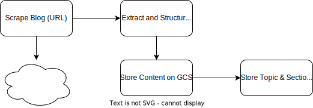

# Tome Scraper Microservice

This microservice is the one responsible, in the Tome Architecture, to scrape curated blogs to create the Tome Knowledge Base. 

## Ingestion of a Blog into the Knowledge Base
Tome Scraper provides an API to ingest a provided blog into Tome's Knowledge Base.   
To do that it uses [Playwright](https://playwright.dev/).

The ingestion is **specific to the Blog Site**, since it's based on scraping. Currently the following Blog "sites" are supported: 
* [Craft](https://docs.craft.do) - I keep many of my knowledge articles there.

This API provides an endpoint that only performs the following:
* Scrapes the provided blog (only specific blog sites are supported)
* Extracts the content structured as per Tome's Knowledge Base standards:
    * A title (of the blog), which corresponds to Tome's **Topic**
    * A list of sections, each of which has a title (Tome's **section**) and content. The content of each section is a list of paragraphs (pure text).
* Saves the content in GCS, structuring it according to Tome's KB Structure (see [Tome's Readme](https://github.com/nicolasances/tome)). 
* Updates the DB with the new Topic

A Diagram of this process:

